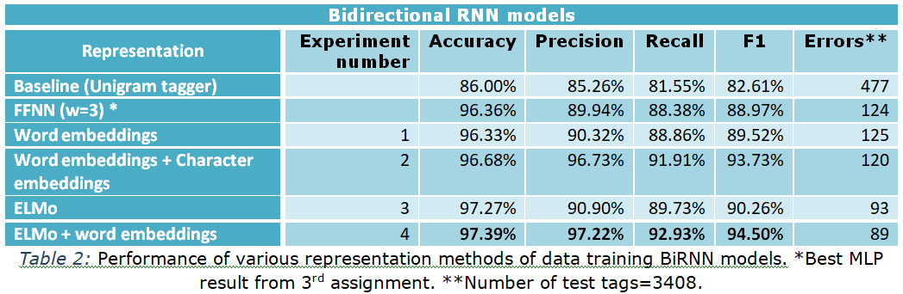

# Α BiRNN Pos Tagger trained on UD treebank

The task of this work is to develop a part-of-speech (POS) tagger for the English language of the <a href="http://universaldependencies.org/">Universal Dependencies</a> treebanks, using a bi-directional stacked RNN (<a href="https://eclass.aueb.gr/modules/document/file.php/INF210/slides_2018_19/nlp_slides_part04_nlp_with_rnns.pdf">slide 21</a>), with GRU or LSTM cells  implemented in Keras. Note that we use the <a href="https://keras.io/getting-started/functional-api-guide/">functional API of Keras</a>, as it is more suitable for complicated architectures.

In <a href="https://github.com/soutsios/pos_tagger_mlp">Αn MLP Pos Tagger trained on UD treebank</a>, with a sliding window over all terms in each sentence, and a pre-trained word embeddings model to represent each term as a feature vector, we approached an accuracy 96.36% with a fully connected FFNN (96.42% with Logistic Regression). We were very interested to see how much improvement may be achieved using RNNs.

It is worth mentioning that we have faced many challenges that we have successfully addressed by implementing our own programming solutions. Many functions are used in different parts of code. For clarity reasons our functions are introduced where firstly used.

Special care was taken for:
1.	Reproducibility reasons -->> seed the numpy generator before every Keras Layer.
2.	Exact accuracy estimation -->> exclude predictions for –PAD- character (Keras *zero_mask*, *mask* variable in our function *y2label()* where from the flatted label sequence, –PAD- character is excluded).

## Implemented Models
Unlike feed-forward neural networks, **recurrent neural networks (RNNs)** can use their internal state (memory) to process sequences of inputs. We take advantage of this temporal dynamic behavior of RNNs to automatically extract features. We use a bi-directional RNN and experiment with *GRU* or *LSTM* cells. We implement 4 models that are gradually progressing to the toughest (1-4):
1.	A Bi-directional RNN with pre-trained word embeddings.
2.	Enhance the above model with an extra RNN layer to produce word embeddings from characters, concatenating each resulting character-based word embedding with the corresponding pre-trained word embedding.
3.	Add an extra layer with ELMo deep contextualized word representations to obtain context-sensitive word embeddings.
4.	Concatenate ELMo deep contextualized word representations with word embeddings.

## Word + Character level model
The architecture implemented in model 2:

## Experimental Results - Conclusions
Sequence labeling systems traditionally require large amounts of task-specific knowledge in the form of hand-crafted features and data pre-processing. In this work, we experimented with neural network architectures that benefit from both word- and character-level representations automatically, by using bidirectional RNNs.
The results of our 4 experiments are summarized in Table 2 where appropriate evaluation metrics are given for every experiment. A Baseline and also the best result with a fully connected FFNN are included.

We reached **97.39%** accuracy, using a one-layer BiRNN with GRU cells, and representations from ELMo and pre-trained word embeddings. The overall conclusion is that ELMo, due to its high-quality deep context-dependent representations from bidirectional Language Models, gives an important improvement to the POS tagging task.

## Some final points:

1. For word- and character-level representations we used two methods
   - Concatenation of context independent word embeddings with character-based word embeddings
   - ELMo deep contextualized word representations
2. ELMo seems to catch basic syntax needed for POS tagging better at first biLM layer than the weighted sum of the 3 layers.
3. Adding pre-trained vectors to ELMo contextualized representations provides a marginal improvement over ELMO only model.
4. To present the evaluation results in a unified manner for all 4 experiments wasn’t an easy task. So we used the appropriate transformations and our functions y2label(), make_prediction(), find_error(), to a lot of tasks like in:
   - Classification report
   - Make a prediction for a test sentence
   - Tag an unknown sentence
   - Frequent types of mistakes
